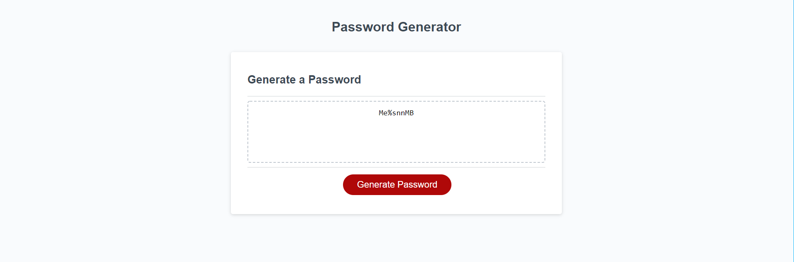

# Password-Generator

## Link to the project
https://samz1n.github.io/Password-Generator/

## Goals for the project
* Revise source code to present a series of prompts for password criteria.
* Allow for the choice of password length 8-128 characters.
* Allow for the choice of numbers, special characters, lowercase and uppercae letters in the password.
* When each prompt has been answered the input should be validated and at least one character type should be selected.
* After each prompt has been answered then a password matching the criteria is generated and displayed on the page.

